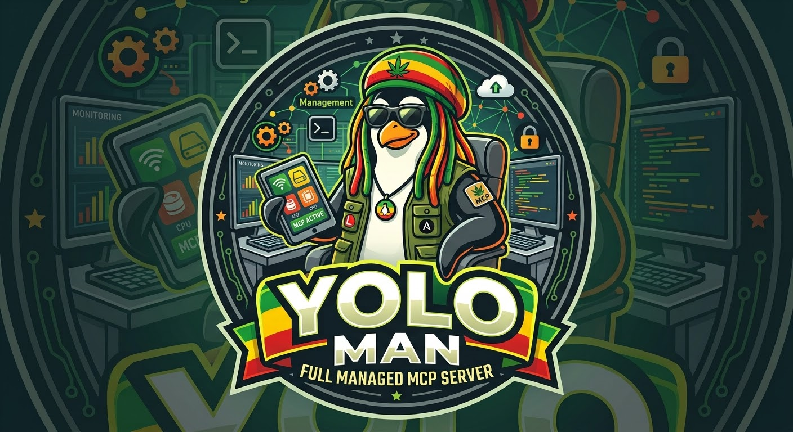
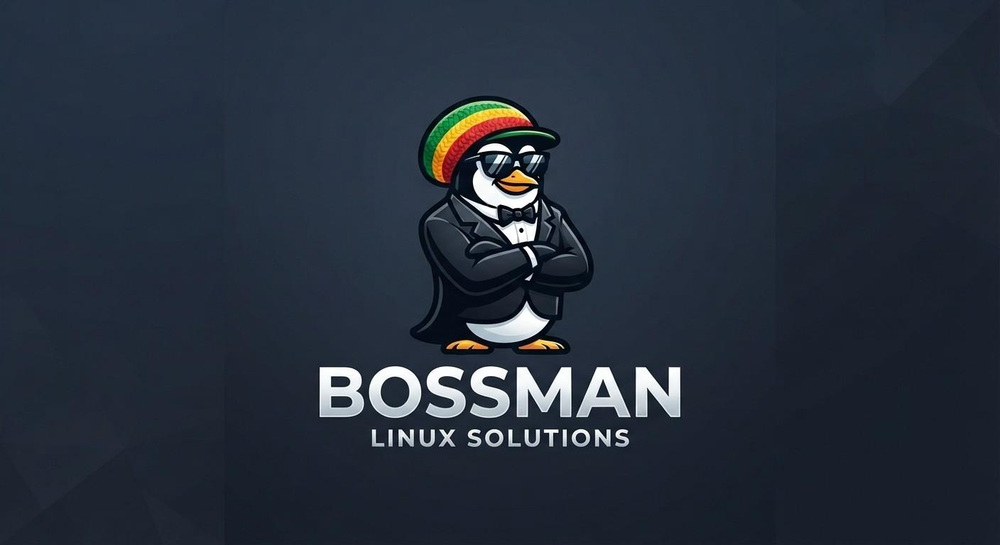

# YOLO-MANager (`agentic-mcp`)



> *"You only live once — but your servers only get one uptime SLA, so let's not get carried
> away."*

A self-contained Linux fleet-management stack that hands your servers' **monitoring**,
**observability**, and **configuration management** to an AI — over [MCP](https://modelcontextprotocol.io)
(stdio or Streamable HTTP) and a plain REST API. No Ansible, no SSH agent, no Python runtime on the
managed host. The node agent ships as a single static Go binary with a hardened systemd unit; the
central Fleet Commander ships as a Docker Compose stack.

Think **CheckMK** (monitoring) + **Coroot** (eBPF observability) + **Ansible** (configuration
management), minus the three separate tools, plus one thing they don't have: an API and a
configuration language built for a language model to actually drive — safely.

**The goal: a server that is completely manageable over one API, in JSON.** Every operation —
monitoring, observability, package and service management, users, storage, network, and running
runbooks — is a JSON request against the agent's unified REST/MCP API. No SSH, no config files to
hand-edit, no separate control planes: the running server's whole state and every action is
expressible as JSON in and JSON out, so a human, a script, or an AI drives it the same way. A
standalone host can be managed directly through the agent's own API (and its embedded web UI);
a fleet is the same API aggregated by Bossman.

Two cooperating components:

- **Duppy** — the node agent (this repo root). Runs on every server. *Duppy* is Jamaican patois
  for a background spirit — coincidentally why Unix daemons are spelled that way. Ours mostly
  watches `/proc` and restarts services on request.
- **Bossman** — the central Fleet Commander ([`bossman/`](bossman/) + [`bossman-ui/`](bossman-ui/)).
  Aggregates the fleet, compiles per-host desired state (GPO-style), translates foreign automation
  (Ansible collections, Checkmk checks) into the agent's sandboxed runtime, and gives an AI one
  endpoint for the whole infrastructure.

---

## Why Starlark, and why Ansible syntax?

Two deliberate language choices sit at the centre of this project. They're worth explaining up
front because everything else — the module library, the checks, the runbooks and roles — is
expressed in them.

### Starlark for logic — "like Ansible, but it runs sandboxed inside the agent"

The built-in modules are native Go. But the *extended* vocabulary — every custom check and module — is written in **[Starlark](https://github.com/bazelbuild/starlark)**,
the small Python dialect from Bazel. Why not just run Python, or shell?

- **It's a sandbox by construction.** Starlark has no `import`, no filesystem, no network, no
  `os`/`sys`, no ambient authority at all. A module can only touch the system through the
  capability object `ctx` we pass in (`ctx.run`, `ctx.file_read`, `ctx.file_write`, `ctx.stat`,
  `ctx.facts`). You cannot write a module that quietly opens a socket or reads `/etc/shadow` unless
  we handed it that capability. That's the opposite of "curl | bash" or an unrestricted Python
  plugin.
- **It's deterministic and terminating.** No unbounded loops, no recursion, no wall-clock, no
  randomness by default. The same inputs produce the same plan. That's what makes a *dry run*
  (`check_mode`) trustworthy: the preview is the execution.
- **It looks like Python, so an LLM writes it fluently** — but the differences (`== None` not
  `is None`, `fail()` not exceptions, `%`/`.format()` not f-strings) are few, mechanical, and
  enforced by a validator, so a model's output either lint-cleans or gets a precise correction to
  retry against.
- **One validator, one runtime.** `validate ≡ execute`: the Go `starlark-check` binary that gates a
  module is built from the *same* `internal/starmod` package the agent runs it with. A module that
  validates here runs there — they cannot drift.

So a "module" or a "check" is one `.star` file defining `def main(ctx, params)`. Action modules
return `{"changed": bool, "msg": str}`; checks are read-only and return
`{"changed": False, "msg": str, "data": {"state": "OK|WARN|CRIT|UNKNOWN", "metrics": {...}}}`.

### Ansible task syntax for authoring — "the format your team already knows"

Runbooks, roles and plans are written in **real Ansible task syntax** — module-as-key plus the task
keywords (`when`, `loop`, `register`, `notify`, `tags`, `block`/`rescue`/`always`,
`failed_when`/`changed_when`, and `key=value` free-form). It is the *only* authoring format, and the
reason is interoperability: an existing role imports and runs, so onboarding a shop means ingesting
the automation it already has rather than rewriting it. Measured against upstream
`geerlingguy.nginx`: **10 of 10** task files parse (see
[`docs/orchestration-import.md`](docs/orchestration-import.md), which also records what the Salt,
Puppet and Chef importers still refuse).

The runtime is unchanged — Ansible is the *syntax*, not the engine. A task parses into a canonical
JSON document, and the Go agent executes it against the Starlark/native module library. No Python,
no SSH-per-task, no control node.

> A NestedText authoring format used to sit beside this one, chosen because it has no implicit typing
> (no [Norway problem](https://hitchdev.com/strictyaml/why/implicit-typing-removed/): `no` staying
> `no`, `0755` staying a string). It was removed — a format only this system can read trades
> interoperability for type safety, and maintaining two grammars caused three real bugs. Type
> coercion now happens at the module boundary, exactly where Ansible does it. The full rationale is
> in [`docs/nestedtext-removal.md`](docs/nestedtext-removal.md).

The *behaviour* is the Starlark. This split — **declarative data in the task document, sandboxed
logic in Starlark** — is the core of how yolo-man stays both AI-authorable and safe.

---

## The node agent (Duppy)

Runs on every managed host. Highlights:

- **A full built-in module library, native in Go** — `file`, `copy`, `lineinfile`, `blockinfile`,
  `replace`, `template`, `apt`/`yum`/`dnf`/`package`, `service`/`systemd`, `user`, `group`, `cron`,
  `git`, `unarchive`, `get_url`, `uri`, `iptables`, `reboot`, and read-only facts (`setup`, `stat`,
  `find`, `service_facts`, `package_facts`, …). Idempotent, `check_mode`-aware, `changed: true/false`
  reporting — no Ansible on either end. Every module names its Ansible/Chef/Puppet/Salt/Terraform
  equivalent so an AI can translate from any of them without external docs.
- **A sandboxed Starlark module runtime** (`internal/starmod`) with a `json` builtin, an
  `isinstance` shim, and the `ctx` capability API — Bossman pushes translated collection modules and
  checks here (`POST /api/v1/modules/apply`), and they run by name via `POST /api/v1/tools/{name}`.
- **Nagios/CheckMK-compatible custom checks** — drop in any Nagios plugin or Checkmk local check
  with no rewrite. The `check_plugin` wrapper **auto-detects** which convention the command's output
  follows (Nagios exit-code + `text | perfdata`, Checkmk local `status item perf details` lines, or
  Checkmk `<<<agent>>>` sections) and normalizes it to the verdict — no need to pick a wrapper.
- **Web shell console** (Proxmox-style) — an interactive terminal for any host, right in the UI's
  Console tab. xterm.js over a WebSocket that Bossman proxies to the agent's PTY running `/bin/login`,
  so you log in with OS credentials in the browser. mTLS + the per-host manage ACL gate it.
- **eBPF observability** (Coroot-style) — TCP connection tracking, process-exec events, disk-I/O
  latency, container-aware, with graceful degradation on older kernels.
- **Local SQLite metrics store** with retention/downsampling and a bulk `metrics_dump` endpoint.
- **PAM login + SQLite-backed per-token/user/group ACL** with a per-tool kill switch, enforced
  identically over MCP and REST. Every mutating action previews in `check_mode` first; real
  execution requires a global `write: true` switch (default `false` — mutating tools aren't even
  registered otherwise).
- **Three modes** — `standalone` (**the packaged default** — a fully self-contained Duppy),
  `satellite` (Bossman pulls its data — `agentic-mcpd register` switches a standalone agent to this
  automatically on enrolment), and `proxy` (**Selecta** — pulls from satellites over mTLS and
  re-serves the aggregate). Machine-to-machine auth is TLS client certs pinned per caller (the
  `authorized_keys` model, over TLS).
- **`.deb`/`.rpm` packaging**, a hardened systemd unit, a self-contained embedded web admin UI, and
  structured audit logging (one JSON line per call to journald).

See [`docs/plan.md`](docs/plan.md) for the module-by-module scope and how each was verified.

## Is this actually a good idea?

"YOLO" as an engineering philosophy has a well-earned reputation, and handing infrastructure to an
autonomous agent has its own research trail — [Gartner predicts 40% of enterprises will decommission
autonomous AI agents by 2027](https://www.gartner.com/en/newsroom/press-releases/2026-05-26-gartner-says-applying-uniform-governance-across-ai-agents-will-lead-to-enterprise-ai-agent-failure),
with over-permissioning the recurring root cause. So why point something called YOLO-MANager at your
servers?

Because nothing here is a blind commit to prod. Every mutating action runs first in `check_mode` — a
full dry-run preview — before it's ever allowed to run for real, real execution needs an explicit
`write: true`, there's a graduated per-user/per-token/per-tool ACL with a kill switch, and every
call is audited to journald. The Gartner finding — that governance fails when it's all-or-nothing
instead of graduated — is more or less this project's whole design brief. Full model in
[docs/plan.md](docs/plan.md#security-model).

---

## The Fleet Commander: Bossman



Bossman aggregates the fleet and gives an AI (and you) one place to run it. What it does today:

- **Fleet inventory & monitoring** — hosts, services, metrics, problems, downtimes,
  notifications, availability, dependency/topology graphs. eBPF "top talkers" reverse-resolve their
  destination IPs to hostnames.
- **The server as one document** — every host compiles to a single `desired_state` JSON: its OU,
  monitoring (checks/thresholds/notifications), orchestration (roles/plans), the GPO-resolved
  **managed config** (per-key winning source), and a full **inventory** tail (OS/kernel, hardware,
  network, and the installed-package list). It's what the AI reads for analysis and what the
  gpresult-style report on each host renders.
- **Policy & Orchestration (GPO-style)** — an **OU tree** (LDAP-style, ltree-backed) with, as a
  second root branch beside it, **Sites** (subnet-scoped, AD "Sites-and-Services"-style: a host is a
  member of a Site when its primary IP falls in one of the Site's CIDRs). Plus first-class **host
  groups** and **orchestration plans/roles**. Per-host desired state is compiled with real GPO
  precedence — `global < group < OU(root→host) < Site < host`, closest-to-host wins — with `enforced`
  links and block-inheritance, resolved server-side and previewed before it's pushed. Fleet-wide check
  thresholds ship as an auto-created **Default Policy** rather than nameless globals.
  - **Named policies (a GPO is a container).** A policy has a **name** and holds **several entries**
    (one per config file); you author it once in the **policy library** — a Miller-column browser
    (**policies → entries → every set value at a glance on the right**) — and **link it to an OU / Site
    / group**, which applies all its entries there at once. Policies can be authored **unlinked** and
    linked later (drag onto a scope). Config values are edited in the gpedit editor (categories → file
    → typed settings), never as raw text.
  - **The right pane is a policy report (RSoP), not an editor.** Select an OU or Site and it shows
    **what actually applies here** — config policies, thresholds, plans, notifications, **and the
    Variables** — each tagged with its **origin** (`here` vs an ancestor OU vs `Global`). OU/group
    **Variables** also appear as their own object in the tree. An **"Effective thresholds"** tab on
    each host shows, per metric, **which rule wins and why** (closest-to-host).
  - **Draft mode.** Linking/binding/assigning/threshold/delete gestures are **staged**, not applied
    immediately: a bottom-right bar shows the pending changes with **Apply** (activate them, converge
    hosts) and **Revert** (discard) — nothing is written until you Apply.
- **Management console (MMC-style)** — each host's Management tab is a console: a snap-in tree
  grouped by category, the selected panel in the middle, an Actions pane on the right. Snap-ins:
  *Server* — Roles & Features, Services, **Scheduled jobs** (crontab CRUD + systemd timers),
  Updates, **Software sources** (APT one-line + deb822 repos), Logs, Accounts; *Monitoring* —
  Service checks; *Network* — Network, **Firewall**; *Storage* — Storage; *Identity* — FreeIPA;
  *Virtualization*; and a **Package configuration** category with purpose-built editors for the
  services a host runs: **BIND zones** (zone lifecycle + records), **NFS exports** and
  **Samba shares** (structured options with a **remote directory browser** for share paths),
  **DHCP server** (scopes + reservations + lease list, via a dedicated `dhcpd` codec),
  **Pure-FTPd** / **ProFTPD** (virtual FTP users, each home a share) and **CUPS printing**
  (printer management via `lpadmin`/`lpstat`). The **Firewall** snap-in is one firewall-cmd-simple
  front-end over whichever backend the host runs — **firewalld / ufw / iptables, auto-detected** —
  covering allow/deny (port or service), SNAT/DNAT, and a server↔router mode toggle (IP forwarding
  + masquerade); enabling it whitelists the agent's own management port first so it can never lock
  itself out.
- **Roles & Features installation wizard** — like Windows Server Manager's "Add Roles and
  Features": pick server packages, configure each through a generated input mask (every setting
  shown with its description **and default value**), preview as a dry run, then install — all in
  the console. Each configurable package ships a seeded `install-<pkg>` runbook (install → render
  config from its template → validate → enable/restart service) with a typed parameter schema;
  works across Debian and RedHat via a per-family package catalog. Repeated config (DNS zone
  records, nginx/apache vhosts + upstreams, …) is just a list-of-objects template variable the mask
  renders as an inline table editor — **no bespoke agent code per role**, since a zone file or vhost
  is only a Jinja2 template. Templates are grown two ways by `qwen79b`: generated from man pages,
  and **translated from battle-tested Ansible roles** (geerlingguy.\*, bertvv.bind, …) found via
  web search. A background pass then has qwen **audit every role against its official documentation**
  (fetched via SearXNG) and record which template directives or runbook steps are still missing
  (`configs/package_doc_audit.json`). Ticking **"Set up a monitoring check"** on the final step
  auto-assigns a `service_health` check for each installed role (configured from the role's own
  service). And a wizard *is* just a runbook: the Confirmation step shows the composed runbook — one
  `runbook: install-<pkg>` role call carrying your variables — which you can **copy or Save as a
  template** before installing, then edit/re-run it in the Workflow designer.
- **A runbook can call a role as a task** — Ansible `import_role`-style: `- runbook: install-nginx` /
  `vars: {…}` inlines that stored runbook's steps (with its defaults + your vars) at run time. So
  roles/wizards compose as one-line plaintext tasks, self-correctable in the editor.
- **Active service checks** — the Checkmk "Services" rules (HTTP, TCP, DNS, cert, …) as plaintext
  Starlark checks: the agent gained a native `ctx.probe(http|tcp|dns)` (status/timing/TLS-cert/
  banner/records), and a background batch translates each Checkmk active check into a check + typed
  options schema. Configure them per host in the **Service checks** MMC snap-in — pick a check, fill
  the same param-form the roles wizard uses, assign; several instances per host (each its own named
  service).
- **Config management with drift enforcement** — a gpedit-style editor (categories → files →
  settings) authored from the codec registry; a key with no policy is **host based** (the host's own
  value stands). Managed files are **auto-enforced every poll**: an out-of-band change is overwritten
  back to desired and recorded as a roll-backable generation. Config **templates** (apache2 vhost,
  chrony, …) are also usable from a runbook via a `config_template` step.
- **Security** — the fleet's pending package updates organised by **package → the CVEs it closes**,
  each with severity, a plain-language description (Debian tracker) and a link, plus bulk security
  updates across the affected hosts.
- **Checks subsystem** (see below) — a flat `checks.d` library of monitoring checks, assignable to
  host/group/OU with per-scope thresholds, with auto-discovery and credential provisioning. State
  checks (a service is running or not) drop the meaningless comparison/warn-crit inputs.
- **Agent-less devices** — SNMP gear and SSH-only hosts monitored via a co-located poller, presented
  as monitored hosts; the "what to monitor" picker labels **and explains** each check (a one-paragraph
  summary from its description), not just a bare name.
- **Visual workflow designer** — a drag-and-drop runbook builder whose toolbox is searchable across
  the whole module catalog.
- **Users & Access** — human users (admin/operator), machine API tokens, and per-host/group
  **access grants** (admin manages everything; operator/token only what a grant covers).
- **AI chat console** — Claude CLI, ChatGPT Codex, a self-hosted OpenAI-compatible model, or
  **OpenRouter** (any hosted model, incl. small/cheap ones — verified end-to-end with a 7B model
  driving the fleet), agentic (the model calls fleet tools), rendering Markdown + PlantUML/diagrams
  and a generative dashboard. The console's tool set includes `bossman_guide` (the operator skill),
  `search_help`, host/fleet inspection, problems, runbooks and the check catalog, so even a small
  model can inspect and plan; mutations stay on the audited MCP/REST paths.
- **The translator** — pulls Ansible collections and Checkmk checks through an LLM
  (`llamacpp03/qwen79b`) into the agent's Starlark runtime, validated by the same `starlark-check`
  gate the agent uses.
- **A lifecycle-complete MCP surface, described as a DevOps skill** — the whole of Bossman is
  driveable over MCP, and it's **self-teaching** so even a small model can run it: the MCP server's
  `instructions` (and a `bossman_guide` tool) are a complete operator skill that maps each task to the
  exact tool, and `search_help` searches the product docs. A model can run the entire loop:
  **discover** (`list_hosts`, `host_status`, `diagnose_host`, `list_problems`, `list_roles`,
  `get_doc_audit`), **research** (`web_search`, `fetch_url` — backed by the internal SearXNG),
  **find & read the building blocks** (`get_role`; `list_config_templates(query)` / `get_config_template`;
  `list_checks(query)` / `get_check`; `list/search/get_runbook`) — checks and templates now carry
  **descriptions** so they're findable by what they do — **install & configure** (`run_runbook`,
  `set_host_config`), **policy** (`get_ou_tree`, `propose_orchestration_plan_link`, `set_threshold`),
  and **verify** (dry-run + `get_host_desired_state`, `blast_radius`). Writes keep the
  AI-proposes-human-confirms posture: they preview in `check_mode` / stay `pending_approval` and only
  mutate for real once the global YOLO-MAN switch is on.
- **A new role or module is no problem** — because that MCP surface is *full-managed*, adding one is
  a first-class operation, not a code change. A **new module** is translated into the agent's Starlark
  runtime through the LLM and admitted by the same `starlark-check` gate — `submit_module` lands it in
  the library and it's immediately an executable tool fleet-wide. A **new role** needs only that its
  package be known: the `qualify_package` MCP tool runs the whole generation pipeline for it in one
  call (the *same* pipeline the host batch uses, grounded on man pages + the shipped `.deb`) — **codec** (classify the config file + mine its per-directive ADMX value catalog),
  **template** (whole-file template + typed schema), and **enum enrichment** (doc-grounded dropdowns) —
  then rebuilds the catalog so the package shows up as an installable role in the wizard, dropdowns and
  all. No bespoke per-role agent code: a role is a package name + a Jinja2 template + a schema, and the
  model produces those itself. The generated catalog also ships **inside the agent package**
  (`/usr/share/agentic-mcp/configs/`), so the Server Manager keeps offering those roles even
  **standalone**, with no Bossman attached.

**Try the whole stack locally** — Postgres/TimescaleDB, migrations, an `admin`/`admin123` seed user,
the FastAPI backend, and the Angular frontend behind nginx:

```bash
docker compose up -d --build
```

Open the URL `docker-compose.override.yml` publishes for `bossman-ui` (`4201` by default) and sign
in with `admin` / `admin123`.

### Checks: translated + custom, all in `checks.d`

A **check** is a read-only Starlark module that gathers data on the host and reports a verdict
(`state` + `metrics`), plus a **discovery mode** (`params._discover`) that enumerates the items a
host has for it — one per filesystem, per file, per sensor — exactly like a Checkmk
`discovery_function`. All checks live flat in `configs/checks.d/<name>.{star,nt}`:

- **Translated** — Checkmk's ~1400 built-in checks, machine-translated to Starlark.
- **Custom** — hand-authored, and crucially **Nagios- and Checkmk-compatible**: the `check_plugin`
  wrapper runs any external check and **auto-detects** the output convention — Nagios (exit code +
  `text | perfdata`), Checkmk local (one `status item perf details` service per line), or Checkmk
  `<<<agent>>>` sections — normalizing each to the verdict. (The `nagios_plugin` / `checkmk_local`
  wrappers remain for forcing one specific format.) Reuse existing plugins unchanged.

Assign a check on the **host's Checks tab** or, GPO-style, to a **group/OU in OU / Policy** — a
host's own config overrides the inherited one, warn/crit levels merged weakest→strongest.
**Auto-discovery** runs the checks' discovery on a host and proposes assignments; when a check needs
credentials (e.g. a MySQL monitoring user), a **provisioning recipe** (`<name>.provision.nt`) creates
the account on the host and stores the generated credential — the admin credentials are used once and
never persisted. The AI can drive the whole flow and **asks you for any required parameters** before
assigning.

---

## Using Bossman — a task guide (for humans and the AI)

> This section is written for **both readers**: a person operating the UI and the
> **AI assistant**, which reads these docs live via `search_help` (the console + the
> `search_help` MCP tool). Each subsection is self-contained and names the exact
> tool + UI location, so a search for "how do I …" returns something actionable.
> The same task→tool map is the MCP server's `instructions` and the `bossman_guide`
> tool. **Golden rule:** read first (`list_hosts` → `host_status`/`diagnose_host`),
> and every change previews as a dry-run / stays human-gated before it's applied.

### Inspect a host or the fleet (list_hosts, host_status, diagnose_host)
Start with `list_hosts` (name, mode, enrollment, online, OU/tags). For one host:
`host_status(host)` (facts + latest metrics + last run) and `diagnose_host(host)`
(cross-signal snapshot). Fleet health: `fleet_health`, `list_problems`. Logs/procs:
`get_host_logs`, `get_host_processes`. The whole host as one document:
`get_server_document(host)`; ask it a question with `explain_server(host, question)`.
In the UI this is the host's **Overview / Services / Configuration** tabs.

### Configure ONE host (set_host_config)
Set a single config file on one machine: `set_host_config(host, path, values,
dry_run=True)` — it merges into the file via the file's codec (foreign keys kept),
previews the diff, and only writes when `dry_run=False`. Managed files are then
**auto-enforced every poll** (drift is reverted and recorded as a roll-backable
generation). UI: the host's **Configuration → Settings** (gpedit) tab.

### Configure MANY hosts with a policy (named policies, link to a scope)
A policy is a **named container** of config-file entries you author once and **link
to a scope** so it applies to every host under it. UI: the **OU / Policy** page →
**Policy library** (Miller columns: policies → entries → values) → create/author,
then set **Linked to:** an OU / Site / group. Precedence when several apply:
`global < group < OU(root→deep) < Site < host` — **closest-to-host wins** (an
`enforced` link or Block-Inheritance can override). A monitoring limit is a
**threshold** (`set_threshold`); a role/package rollout is an **orchestration plan
link** (`propose_orchestration_plan_link`, which stays *pending approval*). Selecting
an OU/Site shows a **policy report (RSoP)**: everything that applies here + Variables,
each tagged with its origin.

### Scopes: OUs, Sites, host groups, Variables
**OUs** are an LDAP-style tree (drag to reparent). **Sites** are subnet-scoped and
live as a second root branch — a host joins a Site when its primary IP is in one of
the Site's CIDRs. **Host groups** are explicit membership. **Variables** set on an
OU/group are inherited down (overridable closer to the host) and show both as a
tree object and in the report.

### Monitor a host, set a threshold, and see which rule wins (effective thresholds)
See state with `list_problems` and `host_services(host)`. Author a rule with
`set_threshold(host_or_scope, metric, comparison, warn, crit)`. Manage noise with
`acknowledge_problem` and `schedule_downtime`. To see **which rule wins** for a host
and why, open its **Configuration → Effective thresholds** tab (closest-to-host).

### Find and read a check (list_checks, get_check)
`list_checks(query)` returns each check's name, short description, one-paragraph
summary, category and datasource (agent | snmp | ssh) — filter by what it does
(e.g. "cpu", "postgres"). `get_check(name)` returns the full description, its
parameters and the Starlark source. Assign one per host via auto-discovery
(`discover_host_checks` → provide any required credentials → `assign_host_check`).

### Create or run a runbook / playbook (list_runbooks, run_runbook)
Find one: `list_runbooks` / `search_runbooks(query)` / `get_runbook(name)` — each
carries a typed parameter schema. Run it: `run_runbook(runbook, host, variables,
apply=False)` — dry-run first; `apply=True` only takes effect when the global
YOLO-MAN switch is on. Build one visually in the **Workflow designer** (a wizard is
just a runbook: one `- runbook: install-<pkg>` role call with your vars). A runbook
can call a **role** as a task (Ansible `import_role`-style).

### Add a new package or role (qualify_package)
`qualify_package(name)` runs the whole generation pipeline for a package in one call
— **codec** (classify the config file), **directives** (per-directive value catalog),
**template** (whole-file Jinja2 + typed schema) and **enum enrichment** (doc-grounded
dropdowns) — grounded on the man page + the shipped `.deb`, then categorises it into
the catalog so it appears as an installable role in the **Roles & Features** wizard.
No bespoke agent code: a role = a package name + a template + a schema.

### Provision a host over PXE (bootstrap VLAN and production VLAN)
See **Provisioning hosts over PXE** below: create a VM (or arm a bare-metal MAC),
image it, enrol the agent, push the offline-chosen roles. A target can be imaged on a
**bootstrap VLAN** and moved to a **production VLAN** at handoff (hypervisor NIC
retag) — set both in the provision wizard's Virtualization step.

### Driving Bossman with an AI (MCP)
Every capability above is an MCP tool; the server's `instructions` (and the
`bossman_guide` tool) teach a model which tool to use for which task, so even a small
model can operate the fleet. Point any MCP client — or the built-in **AI console**
(Claude CLI / Codex / a self-hosted model / **OpenRouter**) — at it. When unsure,
call `search_help(query)` (these docs) or `bossman_guide()` first.

### Safety model
Reads are free. Writes are **dry-run by default** and preview a diff; on the OU/Policy
page, activation gestures are **staged** behind an **Apply / Revert** bar (nothing is
written until Apply). Orchestration links start **pending approval**; real apply of
runbooks/links is gated by the global **YOLO-MAN** switch. Use `blast_radius(host,
resources)` for a what-if before a risky change.

---

## Working with runbooks and roles

### A runbook

A **runbook** is an ordered list of named tasks; each task is one module call. It is an Ansible task
list, with one addition of ours — `targets:`, which says *where* it runs (Ansible puts that in an
inventory; here the fleet database is the inventory).

```yaml
name: web baseline
targets: group:web-servers
tasks:
  - name: install nginx
    apt:
      name: nginx
      state: present
  - name: drop the vhost config
    config_template:
      template: apache2
      dest: /etc/apache2/sites-available/site.conf
      vars:
        server_name: example.com
    notify: reload nginx
  - name: enable and start nginx
    service:
      name: nginx
      state: started
      enabled: true
handlers:
  - name: reload nginx
    service:
      name: nginx
      state: reloaded
```

Run it dry (preview) then for real:

```bash
yolo-man runbook run web-baseline.yaml --host web01 --check   # dry run: shows exactly what would change
yolo-man runbook run web-baseline.yaml --host web01           # apply
```

The agent's own facts (hostname, distribution, and hardware/DMI like the motherboard vendor) are
available as Jinja variables — `{{ inventory_hostname }}`, `{{ yoloman_distribution }}`,
`{{ yoloman_board_vendor }}` — with no declaration. Every run is recorded as an audit trail (visible
in the UI's runbook editor).

### A role

A **role** bundles what a *kind of host* should be — its tasks **and** the monitoring and
notifications that come with it ("what is orchestrated is monitored"). You bind a role to an OU,
group, or host; Bossman compiles it into the host's desired state. It is the same task syntax under a
`role:` key, plus the two sections a role owns (`monitoring.checks`, `notifications.routes`) — Ansible
has no concept for those, so they are ours, exactly like `targets:`.

```yaml
role: mysql_server
description: A MySQL database server — package, service, monitoring, alerting.
parameters:
  bind_address: 127.0.0.1
  monitor_user: monitor
tasks:
  - name: install mysql-server
    apt:
      name: mysql-server
      state: present
  - name: ensure it is running
    service:
      name: mysql
      state: started
      enabled: true
monitoring:
  checks:
    - mysql
    - disk
    - cpu_loads
notifications:
  routes:
    - dba-oncall
```

Bind it in OU / Policy (e.g. to an OU **Databases**), and every host placed there installs MySQL,
gets the `mysql`/`disk`/`cpu_loads` checks, and routes alerts to `dba-oncall` — with per-host
overrides where you need them.

---

## Provisioning hosts over PXE

Bossman can stand up a brand-new machine — a VM on a hypervisor or bare metal — from a golden disk
image, over PXE, and hand it its roles. The **New deployment** wizard (Library → Disk images →
*New deployment*) walks it: target hostname + network → optional VM host (vCenter/Proxmox) → disk image
+ volume sizing → **roles** → review + deploy. See [`docs/provisioning-wizard.md`](docs/provisioning-wizard.md)
and the [`docs/pxe-*`](docs/) guides for the full design.

A few behaviours are worth calling out — each is load-bearing:

- **VM creation & VLAN.** For a VM target the wizard creates the VM on the chosen node/storage/network
  first; the VLAN is set at the **hypervisor** level (Proxmox per-NIC `tag=`, vCenter via the portgroup),
  never in the guest. The MAC the hypervisor assigns is what the restore job is armed against.

- **Bootstrap → production VLAN handoff.** A target can be imaged on a **bootstrap VLAN** (where the
  DHCP/TFTP/PXE server and the PE live) and then moved to a different **production VLAN** for its running
  life. In the wizard's Virtualization step set both: *Bootstrap VLAN* (imaging) and *Production VLAN*
  (Proxmox tag on the same trunk bridge) / *Production portgroup* (vCenter). The restore job remembers the
  VM (`vm_host_id`/`vm_node`/`vm_id`) and the production segment; when imaging reports done, Bossman moves
  the NIC bootstrap→production on the hypervisor and **power-cycles** the VM (a stop+start, since a running
  Proxmox VM only applies a `net0` change across a full stop+start — a guest reboot would leave it on the
  bootstrap VLAN) so the restored OS boots straight onto production. The handoff is opt-in and best-effort:
  imaging already succeeded, so a retag failure is recorded in the job log for the operator, not treated as
  a failed install. Bossman must be able to reach the agent on the production VLAN for the role-push step.

- **Boot order — disk first, PXE fallback.** VMs are created with `boot: order=scsi0;net0` (Proxmox) /
  `boot_devices=[DISK, ETHERNET]` (vCenter). On the **first** boot the disk is empty, so the firmware
  falls through to the NIC and PXE-boots into the restore; once the image is written, the **same** order
  boots the restored disk. (An earlier net-only order made BIOS guests PXE-boot forever and never come up
  on the restored system.) Note: changing a *running* Proxmox VM's boot order needs a full **stop + start**
  to take effect, not a reset.

- **DHCP/PXE is job-gated.** The PXE/DHCP server only serves while a provisioning job is pending — there
  is no manual on/off switch. The Settings pane just manages the shared netboot secret.

- **Proxy is baked into the target.** When `target_http_proxy` (+ optional `target_https_proxy`,
  `target_no_proxy`) is set, the restore's target phase writes the proxy into the restored root so the host
  reaches package mirrors and the internet from its destination segment: `/etc/environment`
  (`http(s)_proxy` + `no_proxy`, upper- and lower-case) and every package manager — apt
  (`/etc/apt/apt.conf.d/95bossman-proxy`), dnf/yum (`proxy=` in their `[main]`), and zypper
  (`/etc/sysconfig/proxy` incl. `NO_PROXY`). `no_proxy` keeps local/corp traffic direct. Empty = nothing
  written.

- **Roles are desired state.** The wizard registers the target as a **planned** host (a real agent with an
  id, read-only, no address yet) and then uses the exact **Role bindings** workflow from the Management tab
  against it: each role is an `OrchestrationPlan` of type `role`, bound to the host as an
  `OrchestrationPlanLink`. Binding is pure desired state — it does not need the host online — so it is
  declared now and **converges after the host first boots** (approval-gated).

- **The write gate.** Role convergence (module push + mutating steps) needs the agent's master **write
  gate** open. A PXE-provisioned host therefore enrols **write-enabled by default** so its bound roles
  converge with no manual opt-in:
    - `agent_deploy_write` defaults to **true**, so the offline enrol bakes `write: true` into the target's
      `config.yaml`.
    - The registration API takes a per-host override — `PlannedHostIn.write` (default true); set it false to
      provision a monitor-only host.
    - The manual one-liner shows it too: `agentic-mcpd register … --write=true` (`--write=false` = read-only).
  Writes can always be toggled later over the API without SSH, via the agent's self-config carve-out —
  `POST /api/v1/agents/{id}/collect-config {"write": true|false}`, surfaced in the UI as **Enable writes /
  Set read-only** on the host's Role bindings snap-in. The agent rewrites its `config.yaml` and restarts.
  The carve-out is owner-scoped + mTLS-authenticated and still cannot touch the agent's auth, token, listen
  address or TLS.

- **The agent package is bind-mounted, not baked.** Both Bossman and the PXE container serve the agent
  `.deb` (and the PXE PE bakes the `agentic-mcpd` binary) from `deploy-artifacts/` via bind mounts declared
  in `docker-compose.override.yml` — rebuild it on the host with `scripts/build-agent-deb.sh` and every
  consumer serves the fresh package on the next request, no image rebuild.

---

## Build, run, test

```bash
# Node agent
go build -o bin/agentic-mcpd ./cmd/agentic-mcpd
./bin/agentic-mcpd --config configs/config.yaml        # MCP (HTTP) + REST
./bin/agentic-mcpd --stdio --config configs/config.yaml # MCP over stdio
go test ./...

# The Starlark validator (used by Bossman's translator + check library)
CGO_ENABLED=0 go build -o bin/starlark-check ./cmd/starlark-check

# Bossman stack
docker compose up -d --build
```

Without a config file the agent falls back to built-in defaults (`127.0.0.1:8010`, write disabled).

## Learn more

The full design — architecture, module system, security model, the three operating modes, the
policy/orchestration compiler, and the complete roadmap — lives in [`docs/plan.md`](docs/plan.md).
