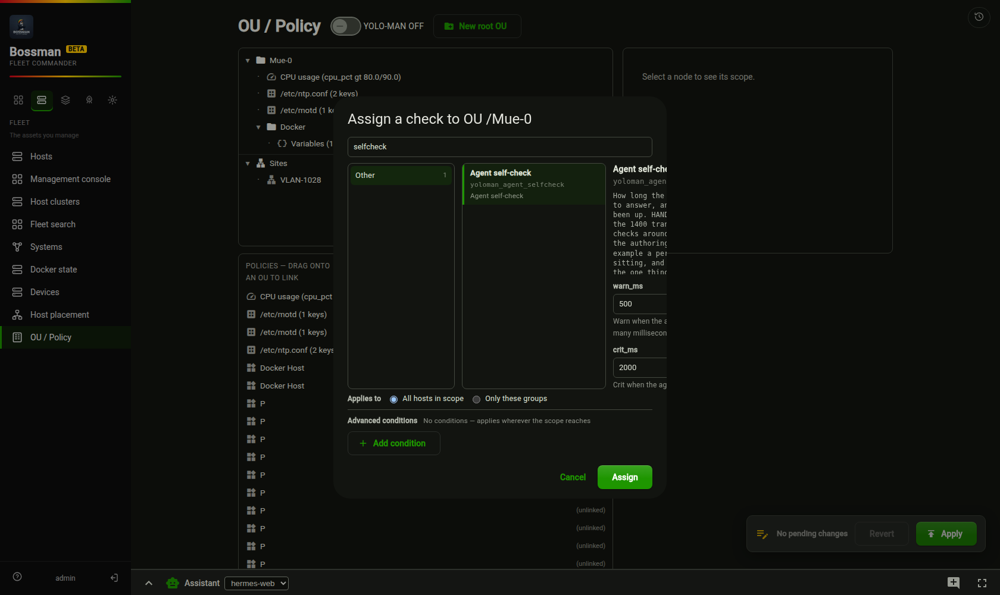
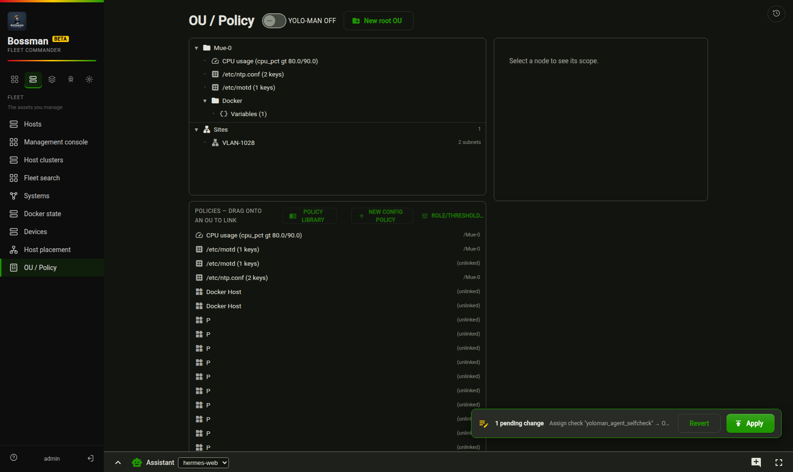
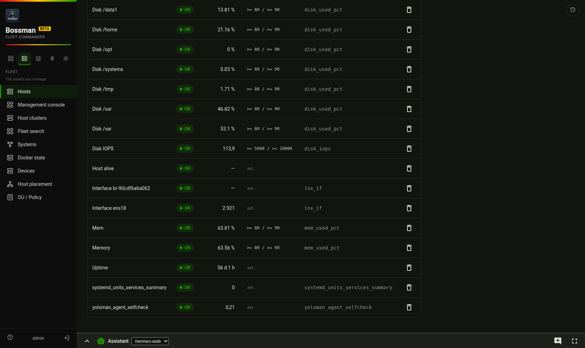

# Writing a check, and getting it onto a host

A worked example, start to finish, with the traps named. Everything here was done on the real fleet on
2026-08-28; the screenshots are of that run.

The example check is [`configs/checks.d/yoloman_agent_selfcheck.star`](https://github.com/imoes/yoloman/blob/main/configs/checks.d/yoloman_agent_selfcheck.star)
— hand-written, unlike the ~1400 translated Checkmk checks beside it, and deliberately small enough to read in
one sitting.

## The five minutes version

```bash
# 1. write the pair: the code and its metadata, same base name, in configs/checks.d/
$EDITOR configs/checks.d/my_check.star configs/checks.d/my_check.yaml

# 2. VALIDATE BEFORE PUSHING. This is the step that saves the afternoon — see "the traps" below.
./bin/starlark-check -strict -params '{"port":8051}' configs/checks.d/my_check.star
#   → {"ok": true, "stub_ok": true, ...}

# 3. assign it in the UI (OU / Policy → right-click a scope → Assign Check…), or via the API
# 4. the poller pushes it to every host in scope and runs it on the next cycle
```

## What a check is

Two files with the same base name in `configs/checks.d/`:

- **`<name>.star`** — Starlark. One `main(ctx, params)`, no side effects, no credentials of its own.
- **`<name>.yaml`** — the sidecar: `name`, `fqcn`, `collection`, `short_description`, `description`, and
  `options` (each parameter with its type, default and description). The UI's parameter form is generated
  from `options`, so a described option is a labelled field and an undescribed one is a mystery box.

The check runs **on the host**, dispatched by the agent, and returns a state. Bossman turns that into a
Service — the same kind of row an agent-reported check produces, so a hand-written check and a translated one
look identical to every screen downstream.

### The return contract

```python
return {
    "changed": False,                       # a check never changes anything
    "msg": "human sentence",
    "data": {
        "state": "OK",                      # OK | WARN | CRIT | UNKNOWN
        "metrics": {"agent_connect_ms": 0.2},   # a DICT of name → number
        "details": "the same sentence, or more",
    },
}
```

`metrics` is a **dict**, not a list of objects, and the metric's name carries its unit
(`agent_connect_ms`, not `agent_connect`) — the contract has nowhere else to put one, and a series nobody can
plot against a threshold is a series nobody plots.

### What `ctx` offers

`probe(kind, params)` (`http` | `tcp` | `dns`), `facts()`, `run(argv)`, `file_read`, `file_write`,
`file_exists`, `stat`, `json`, `regex`, `check_mode`. **There is no clock.** If you want elapsed time, use
what a probe already measures (`connect_ms`, `resolve_ms`) rather than reaching for one.

## The four traps, each of which cost a real run

These are not style notes. Each one produced a failure on a live host during this example.

1. **Starlark has no implicit string concatenation.** Python lets you write two string literals on
   consecutive lines; Starlark does not. The push was rejected with
   `33:95: got string literal, want '}'`. Use explicit `+`.
2. **`%` takes only bare verbs.** `%.1f` and `%02d` parse fine and then raise
   `unknown conversion %.` **at runtime, on the host**. Round with arithmetic and use `%s`. Eight shipped
   checks in this repository have been bitten by this before.
3. **The return contract is exact**, and the stub gate is what tells you so:
   `result is missing required key "changed" (bool)`.
4. **A default that cannot be right is a message, not a guess.** This check's default port (8051, the Go
   agent's) is wrong on a host whose agent listens on 18051 — so its CRIT message names the `port` parameter
   instead of leaving "connection refused" to be blamed on a firewall.

> **And the one that is not the author's fault, now fixed:** a check that fails the agent's validation used to
> be rejected *silently* — the push answered `200 OK`, and the host kept running whatever version it already
> had. A service state then reported an error from source that no longer existed anywhere. Bossman now reads
> the per-module results, logs every rejection with its reason, and marks the check UNKNOWN with
> *"this host rejected the check when it was pushed, so it was NOT run"* instead of running the old copy.

## Assigning it, in the UI

**OU / Policy → right-click a scope → Assign Check…** The left pane is the catalogue (1432 checks, grouped);
the right pane is the parameter form, generated from the sidecar's `options`:



An assignment is a **rule with a scope** — OU, group or host — not a copy of the check. Which hosts it reaches
follows the same precedence as everything else here (global < group < OU < site < host), and the host page
shows what actually applies.

Nothing is written yet at this point. The OU screen **stages** changes and applies them together, so a
session of edits is one reviewable act:



## Seeing it run

On the next poll cycle the check's source is pushed to every host in scope and executed. The host's
**Checks** tab shows the result — the assigned rule above, the measurement below:



```
yoloman_agent_selfcheck   OK   0.208
the agent's port 18051 accepted a local connection in 0.2 ms (warn 50, crit 500) on debian
```

If it does not appear: the check is only pushed to hosts the assignment's scope reaches, and only when the
poller reached the host that cycle. If it appears as UNKNOWN, the output says why — a validation rejection, a
missing parameter, or the check's own error text, verbatim.

## Editing a check that is already assigned

Edit the `.star`, validate, and wait one poll cycle: the poller reads the file fresh each time and pushes it
again. Two things worth knowing:

- **Bossman caches nothing here, but the host keeps a copy** under
  `/var/lib/agentic-mcp/modules.d/<collection>/`, which is what it runs. A rejected push leaves the old copy
  in place — that is the trap above.
- **Parameters live on the assignment, not in the file.** Changing a default in the `.yaml` does not change an
  existing assignment; edit the assignment (or the UI's `set…` control) to change what a host is told.
